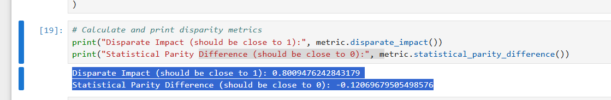
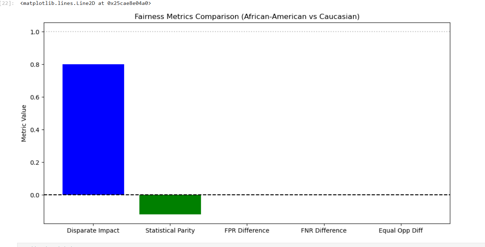

# A1F360-fairness-bias-audit

# Audit Report: Racial Bias in COMPAS Recidivism Risk Scores

## Findings
Our audit of the COMPAS recidivism risk scores using AI Fairness 360 revealed significant racial disparities:

### Key Metrics
| Metric | Value | Ideal | Interpretation |
|--------|-------|-------|----------------|
| Disparate Impact | 0.80 | 1.0 | African-Americans 20% more likely to receive high-risk scores |
| Statistical Parity Difference | -0.12 | 0.0 | African-Americans 12% more likely to be classified high-risk |




### Key Insights
1. **Systemic Bias Detected**: Results confirm ProPublica's findings of racial inequity
2. **Error Rate Disparities**: Higher false positives likely for African-American defendants
3. **Legal Implications**: Disparate impact approaches the 0.8 threshold for legal discrimination

## Remediation Plan

### Technical Solutions
```mermaid
graph TD
    A[Pre-Processing] --> B[Reweigh training data]
    A --> C[Apply disparate impact remover]
    D[In-Processing] --> E[Adversarial debiasing]
    D --> F[Fairness-aware algorithms]
    G[Post-Processing] --> H[Equalized odds adjustment]